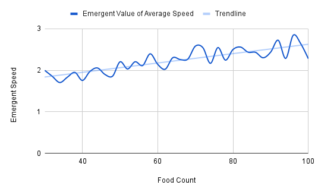
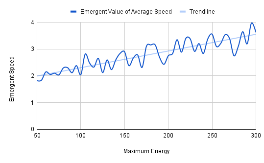
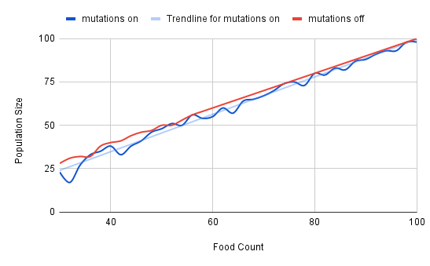

# Simulating the Natural Selection of Speed in a Population of Animals 🔥

Simulating the natural selection of speed in a population of animals living in an environment with finite food resources using NetLogo. This project was a part of the course `ES-491: Modeling and Simulation of Complex Systems`  offered at IIT Gandhinagar in Semester-2 AY 2020-21 under the guidance of Prof. Antonio Fonseca. 

## Table of Contents 📃

**[Requirements](#requirements-)** 
**[Usage](#usage-)** 
**[Model Description](#model-description-)** 
**[Files and Folders](#files-and-folders-)** 
**[References](#references-)** 

## Requirements ⚡

* NetLogo 6.2 (download from [here](https://ccl.northwestern.edu/netlogo/download.shtml))

## Usage ⏩

* Open NetLogo
* Open Model.nlogo using NetLogo
* Adjust values of sliders and switch. 
* Click on the `setup` button and then click on `go`.

## Model Description ⭐

See detailed report [here](https://github.com/frank-chris/Simulating-Natural-Selection-of-Speed/blob/main/Report.pdf)  
See slides [here](https://github.com/frank-chris/Simulating-Natural-Selection-of-Speed/blob/main/Presentation.pdf)

### Objectives

The aim of this project is to study the evolution of the trait ‘speed’ through natural selection in a population of animals living in a simple environment with finite food resources.  Studying the emergence of a value for the average speed of the population and investigating factors that could influence it are also important goals of this project.

### Plots

## Files and Folders 📁

- [`Model.nlogo`](https://github.com/frank-chris/Simulating-Natural-Selection-of-Speed/blob/main/Model.nlogo) - NetLogo model file  
- [`Report.pdf`](https://github.com/frank-chris/Simulating-Natural-Selection-of-Speed/blob/main/Report.pdf) - Detailed report  
- [`Presentation.pdf`](https://github.com/frank-chris/Simulating-Natural-Selection-of-Speed/blob/main/Presentation.pdf) - Slides used for presentation  
- [`plots/`](https://github.com/frank-chris/Simulating-Natural-Selection-of-Speed/tree/main/plots) - Folder containing plots of BehaviourSpace experiment results  
- [`csv/`](https://github.com/frank-chris/Simulating-Natural-Selection-of-Speed/tree/main/csv) - Folder containing csv output of BehaviourSpace experiments  

## References 🔖

[1] Wilensky, U. (1999). NetLogo. [http://ccl.northwestern.edu/netlogo/](http://ccl.northwestern.edu/netlogo/). Center for Connected Learning and Computer-Based Modeling, Northwestern University, Evanston, IL.

